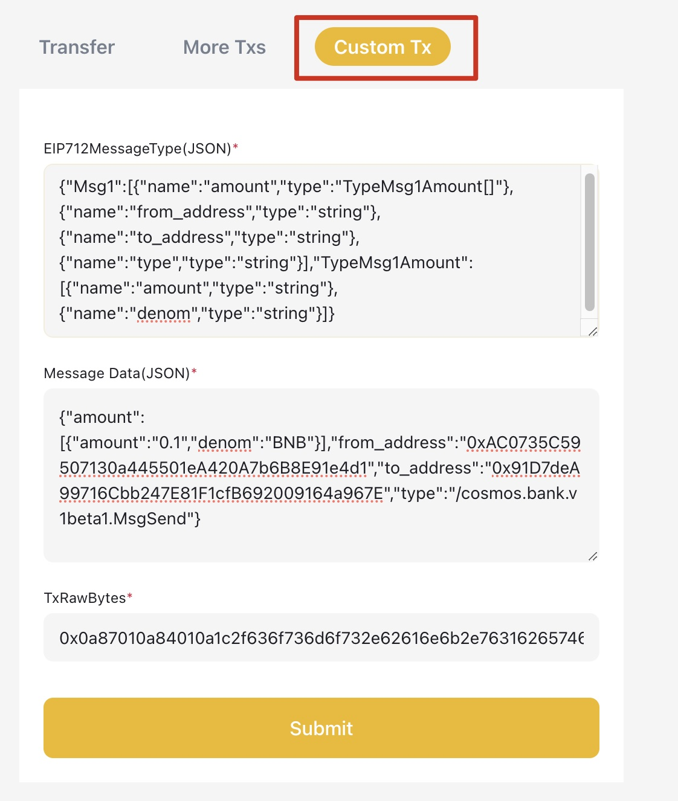

This guide will help you join Greenfield SP Mainnet.

- [Add Storage Provider to Greenfield Mainnet](#add-storage-provider-to-greenfield-mainnet)
  - [1. Submit-proposal](#1-submit-proposal)
    - [Understanding the parameters](#understanding-the-parameters)
  - [2. Deposit BNB to proposal](#2-deposit-bnb-to-proposal)
  - [3. Wait voting and check voting result](#3-wait-voting-and-check-voting-result)
  - [4. Activate SP](#4-activate-sp)
    - [Storage Provider Standard Test](#storage-provider-standard-test)
    - [Update SP status](#update-sp-status)
- [Storage Provider Operations](#storage-provider-operations)
  - [EditStorageProvider](#editstorageprovider)
  - [Update SP quota](#update-sp-quota)
- [Tools](#tools)
- [Trouble shooting](#trouble-shooting)

## Add Storage Provider to Greenfield Mainnet

Greenfield Blockchain validators are responsible for selecting storage providers. For each on-chain proposal to add new storage provider, there are deposit period for depositing BNB and voting period for validators to make votes. Once the proposal passes, new SP can join the network afterwards.

You can query the governance parameters [here](https://docs.bnbchain.org/greenfield-docs/docs/greenfield-api/gov-v-1-params)

### 1. Submit-proposal

The SP needs to initiate an on-chain proposal that specifies the Msg information to be automatically executed after the vote is approved. In this case, the Msg is `MsgCreateStorageProvider`. It's worth noting that the deposit tokens needs to be greater than the minimum deposit tokens specified on the chain.

```shell

./build/bin/gnfd tx sp create-storage-provider ./create_storage_provider.json --from {funding_address} --print-eip712-msg-type

# create_storage_provider.json
$ cat ./create_storage_provider.json
{
  "messages":[
  {
    "@type":"/greenfield.sp.MsgCreateStorageProvider",
    "description":{
      "moniker":"{moniker}",
      "identity":"{identity}",
      "website":"{website}",
      "security_contact":"{security_contract}",
      "details":"{details}"
    },
    "sp_address":"{operator_address}",
    "funding_address":"{funding_address}",
    "seal_address":"{seal_address}",
    "approval_address":"{approval_address}",
    "gc_address":"{gc_address}",
    "maintenance_address":"{maintenance__address}",
    "endpoint":"https://{your_endpoint}",
    "deposit":{
      "denom":"BNB",
      "amount":"500000000000000000000"
    },
    "read_price":"0.1469890427",
    "store_price":"0.02183945725",
    "free_read_quota": 1073741824,
    "creator":"0x7b5Fe22B5446f7C62Ea27B8BD71CeF94e03f3dF2",
    "bls_key":"{bls_pub_key}",
    "bls_proof":"{bls_proof}"
  }
],
  "metadata":"4pIMOgIGx1vZGU=",
  "title":"Create <name> Storage Provider",
  "summary":"create <name> Storage Provider",
  "deposit":"1000000000000000000BNB"
}
```

:::note
In testnet, there are some differences in create_storage_provider.json:

```json
...
"deposit":{
      "denom":"BNB",
      "amount":"1000000000000000000000"
    },
"read_price":"0.108",
"store_price":"0.016",
"free_read_quota": 1073741824,
...
```

Tendermint RPC address in testnet is `https://gnfd-testnet-fullnode-tendermint-us.bnbchain.org:443`, users can fill this address in `--node` flag.
:::

After executing the following command, you will get a JSON input in your terminal, you can save it as a JSON file.

Next you visit this website: `https://gnfd-tx-sender.nodereal.io/`, connect your wallet, choose `Custom Tx`, fill the JSON data and submit:



#### Understanding the parameters

:::note
You can get the gov module address by this command

```shell
curl -X GET "https://greenfield-chain-us.bnbchain.org/cosmos/auth/v1beta1/module_accounts/gov" -H  "accept: application/json"
```

:::

- `endpoint` is URL of your gateway
- `read_price` and `store_price` unit is `wei/bytes/s`
- `free_read_quota` unit is *Bytes*
- `creator` is the address of `gov module`
- `metadata` is optional

### 2. Deposit BNB to proposal

:::note
You can get the mininum deposit for proposal by the above command. Please make sure that the initial deposit is greater than `min_deposit` when submitting the proposal.

```shell
curl -X GET "https://greenfield-chain-us.bnbchain.org/cosmos/gov/v1/params/deposit" -H  "accept: application/json"
```

:::

You can skip this step if the initial deposit amount is greater than the min deposit required by the proposal.

Each proposal needs to deposit enough tokens to enter the voting phase.

```shell
./build/bin/gnfd tx gov deposit {proposal_id} 1BNB --from {funding_address} --keyring-backend os --node https://greenfield-chain-us.bnbchain.org:443 --chain-id "greenfield_1017-1"
```

### 3. Wait voting and check voting result

After submitting the proposal successfully, you must wait for the voting to be completed and the proposal to be approved. It will last **7 days** on mainnet while **1 day** on mainnet. Once it has passed and is executed successfully, you can verify that the storage provider has been joined.

:::caution

Please ensure that the storage provider service is running before it has been joined.

:::

You can check the on-chain SP information to confirm whether the SP has been successfully created.

```shell
./build/bin/gnfd query sp storage-providers --node https://greenfield-chain-us.bnbchain.org:443
```

Alternatively, you can check the proposal to know about its execution status.

```shell
./build/bin/gnfd query gov proposal {proposal_id} --node https://greenfield-chain-us.bnbchain.org:443
```

### 4. Activate SP

#### Storage Provider Standard Test

After the proposal has passed, the status of SP is `STATUS_IN_MAINTENANCE`. To prevent being slashed due to functional abnormalities, you should first perform a full functional test using the maintenance account. You can refer to the [SP standard test](https://github.com/bnb-chain/greenfield-sp-standard-test).

#### Update SP status

Once the testing is completed, you need to send a tx to activate the SP to `STATUS_IN_SERVICE`.

```shell
./build/bin/gnfd tx sp update-status [sp-address] STATUS_IN_SERVICE [flags]
```

Refer to [Maintenance Mode](../../core-concept/storage-provider-lifecycle.md#in-maintenance) for more details.

## Storage Provider Operations

### EditStorageProvider

This command is used to edit the information of the SP, including endpoint, description and .etc.

```shell
gnfd tx sp edit-storage-provider [sp-address] [flags]

cd greenfield/
./build/bin/gnfd tx sp edit-storage-provider ${operator_address} --node https://greenfield-chain-us.bnbchain.org:443
```

### Update SP quota

The update.quota command is used to update the free quota of the SP on greenfield chain, it will send a txn to the chain to finish the updating.

```shell
gnfd-sp update.quota [command options] [arguments...]

cd greenfield-storage-provider/build/
# config.toml is your mainnet config
./gnfd-sp update.quota --quota ${value} --config config.toml
```

## Tools

SP can use Greenfield Cmd or DCellar to verify SP functions in Mainnet:

- Greenfield Cmd: [repo](https://github.com/bnb-chain/greenfield-cmd)
- DCellar: [website](https://dcellar.io/)

## Trouble shooting

If you meet issues, please read [this doc](./common-issues).
